# Yii 2 Basic с админ панелью

1. [Как развернуть проект](#title1)
2. [Структура проекта](#title2)
3. [Скрины и ссылки](#title3)

Возможности:
- Наполнение через админ. панель
- Добавление пользователей, смена пароля
- Форма обратной связи с отображением заявок в админ панели, дублированием заявок на email и в Telegram
- Яндекс карта с контактной информацией
- Скачивание отчета в .xlsx

##<a id="title1">Как развернуть проект</a>

1. Выполнить команду composer install
2. Создать бд `my_db`, отредактировать файл `config/db.php` на свои данные, например:
```php
return [
    'class' => 'yii\db\Connection',
    'dsn' => 'mysql:host=localhost;dbname=my_db',
    'username' => 'root',
    'password' => '1234',
    'charset' => 'utf8mb4',
];
```
3. Запустить миграции php yii migrate/up
4. Entry point приложения: \demo-site\web
5. Админ панель: 
http://**ссылка**/admin-login 
```Логин: admin Пароль: 123456```
6. Укажите telegram-token и id чата в `config/params.php`, параметр `tlg_token` (telegram-token) и `tlg_chat_id` (id чата)

##<a id="title2">Структура проекта</a>
      assets/             содержит определения используемых ресурсов
      backend/            содержит админ панель и компоненты
      commands/           содержит CLI (консольные) команды (контроллеры)
      config/             содержит конфигурация приложения
      controllers/        содержит контроллеры приложения
      environments/       содержит файлы для выбранной среды разработки
      mail/               содержит шаблоны писем
      migrations/         содержит миграции
      models/             содержит модели приложения
      runtime/            содержит файлы генерирующиеся в процессе работы приложения
      tests/              содержит различные тесты
      vendor/             содержит зависимости и пакеты сторонних разработчиков
      views/              содержит файлы представления для приложения
      web/                содержит entry point приложения (index.php) and ресурсы

##<a id="title3">Скрины и ссылки</a>

### **Сайт**
Вся текстовая информация, а также фото и координаты добавляются через административную панель
#### Слайдер
[Наполнение в админ панели](https://github.com/azaliias/demo-site/blob/main/backend/controllers/SlideController.php)
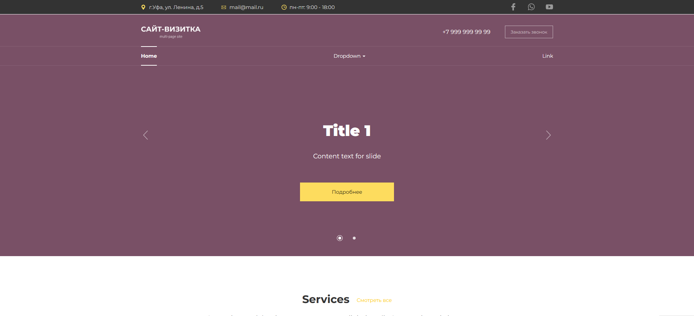
#### ФОС. Заявки сохраняются в административной панели, дублируются на почту и в телеграм
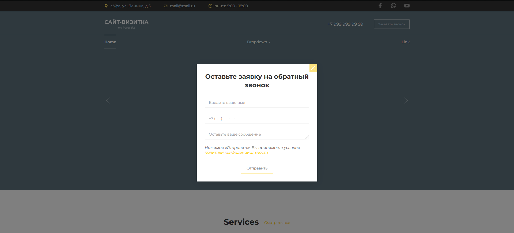
* [Просмотр, скачивание отчета](https://github.com/azaliias/demo-site/blob/main/backend/controllers/ContactController.php)
* [Отправка на почту](https://github.com/azaliias/demo-site/blob/6b937bf982fd0e31da31a2c3705ce6d01fa439fe/models/Contact.php#L78-L104)
* [Отправка в телеграм](https://github.com/azaliias/demo-site/blob/main/backend/components/TelegramBot.php)
#### Услуги
[Наполнение в админ панели](https://github.com/azaliias/demo-site/blob/main/backend/controllers/ServiceController.php)
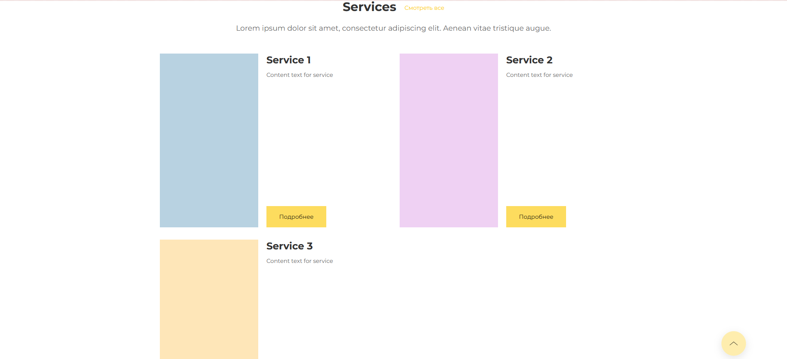
#### Преимущества
[Наполнение в админ панели](https://github.com/azaliias/demo-site/blob/main/backend/controllers/AdvantageController.php)
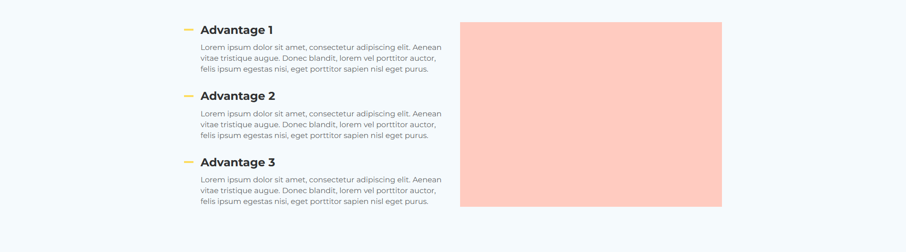
#### Акции
[Наполнение в админ панели](https://github.com/azaliias/demo-site/blob/main/backend/controllers/ActionController.php)
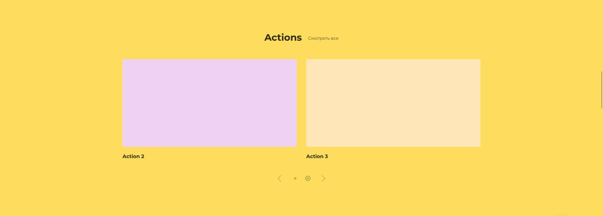
#### Шаги и баннер
[Наполнение в админ панели - шаги](https://github.com/azaliias/demo-site/blob/main/backend/controllers/StepController.php)
[Наполнение в админ панели - баннер](https://github.com/azaliias/demo-site/blob/main/backend/controllers/SettingsController.php#L20-L28)
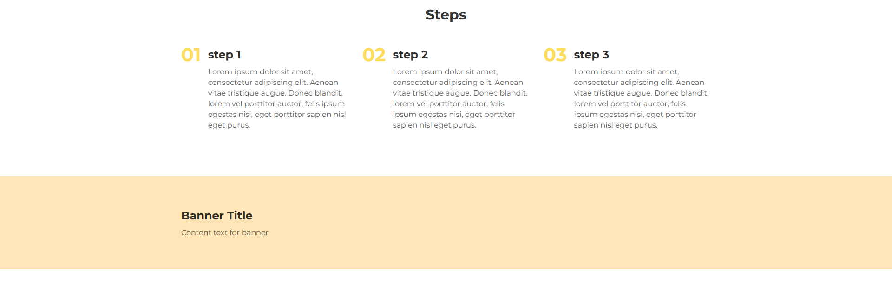
#### Фотогалерея и ФОС
[Наполнение в админ панели фотогалереи](https://github.com/azaliias/demo-site/blob/main/backend/controllers/PhotoController.php)
[Вывод сообщений в админ панель](https://github.com/azaliias/demo-site/blob/main/backend/controllers/ContactController.php)
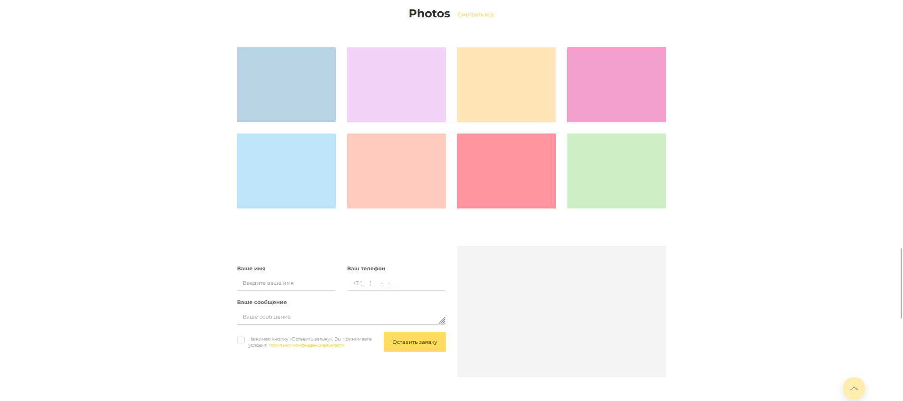
#### О нас и контакты (Яндекс Карта, ФОС)
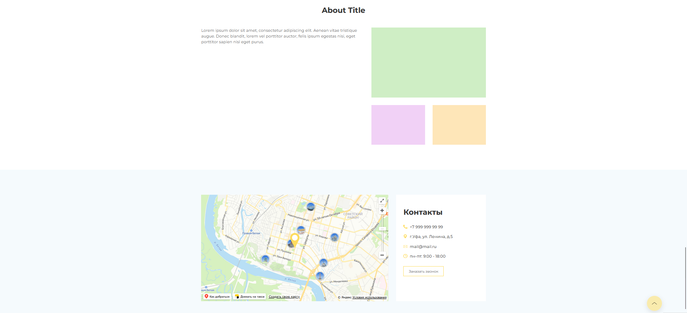


### **Административная панель**

#### Возможности:

- Скачивание отчета в .xlsx и выбор необходимых полей в отчете

- Логирование
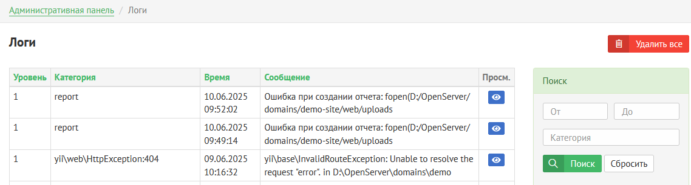
- Поиск по полям
- Создание, редактирование, удаление записей
- Сортировка записей
- Смена пароля пользователя
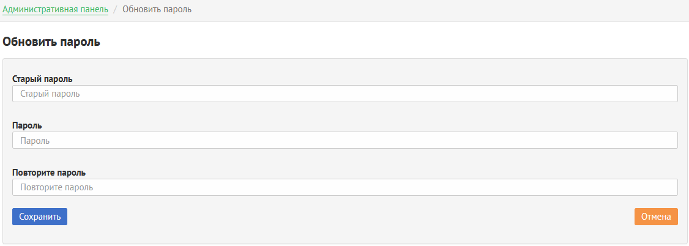
- Наполнение сайта (текстовая информация, фото)
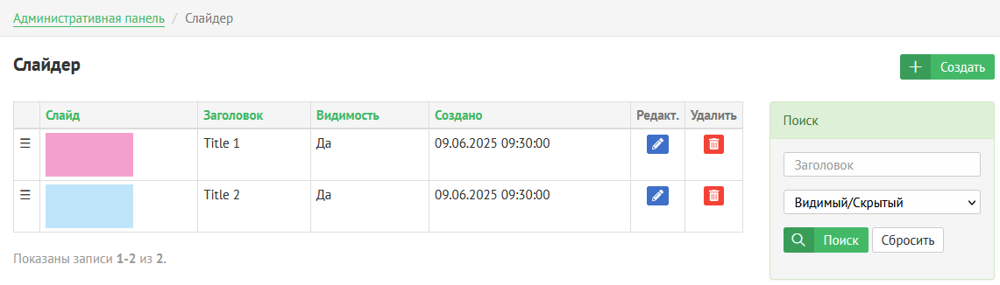
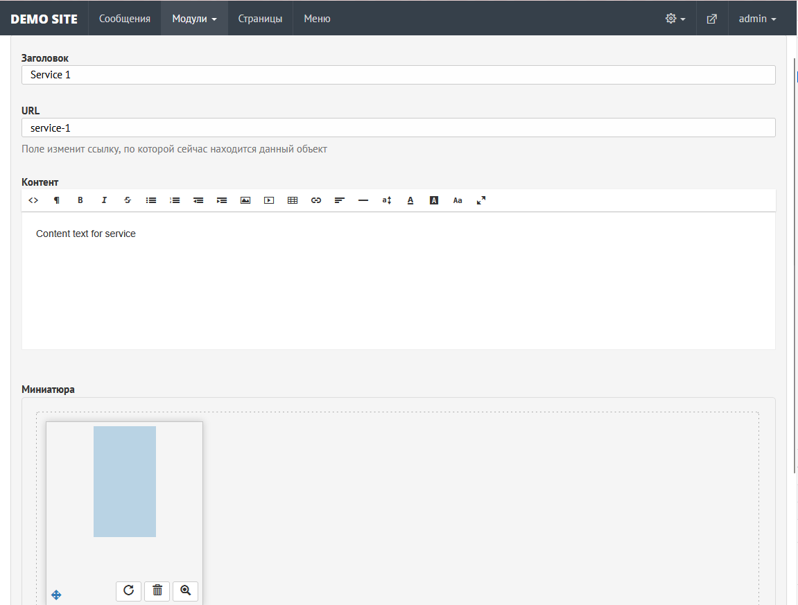
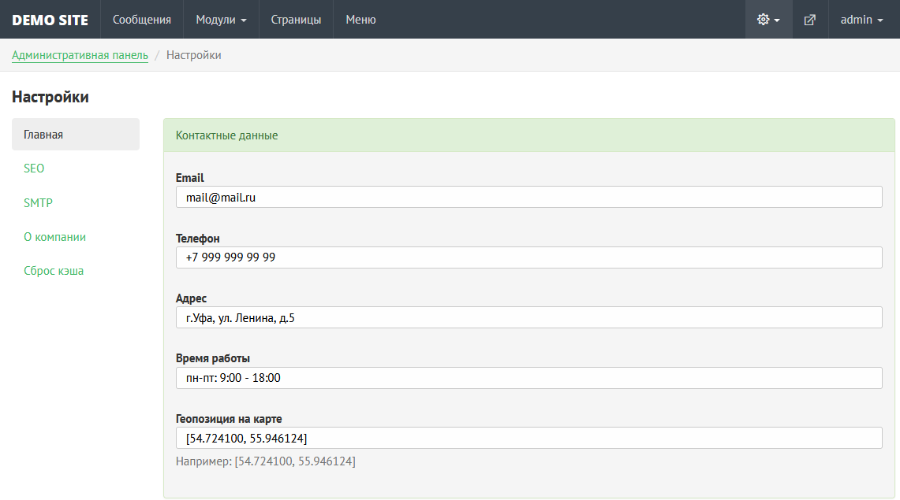